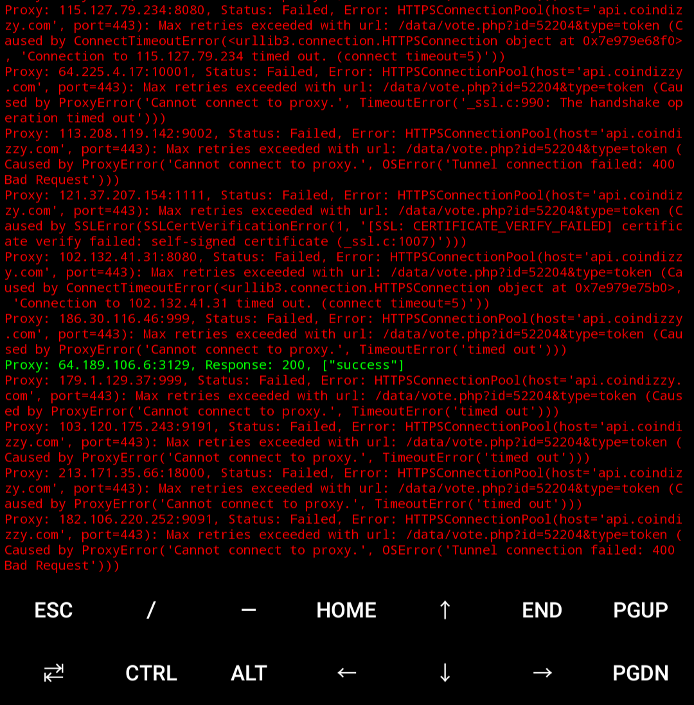
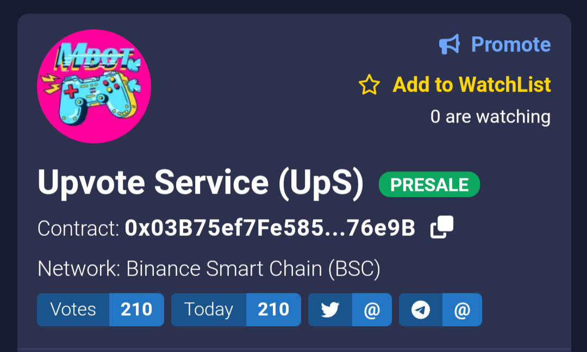

[](https://github.com/naix0x/upvotes-coindizzy/blob/main/LICENSE)


# <h1 align="center">UP VOTES COINDIZZY.COM</h1>

<p align="center">
    
</p>

Just an example of an automatic upvotes, using the `GET & POST` method for `coindizzy.com`, cuz this website does not use captcha, and only a simple POST API for used get votes.  Actually many ways, such as using the puppeteer, selenium, openbullet/silverbullet libraries to do votes that contain buttonid & bypass captcha. but for this one it is only for `educational purposes` & only uses simple libraries that we often use.

## Notice

- Changes line URL of file `votes_managements/target.py` for target to get upvotes

```python
URL_COINDIZZY_VOTE = "https://api.coindizzy.com/data/vote.php?id=52204&type=token"
URL_COINDIZZY_WATCHLIST = "https://api.coindizzy.com/data/watchlist_count.php?id=52204"
```

- Change it in the `votes_managements/api_proxy.py` section if you really have a better proxy api, cuz the proxy api that is used now, is a free proxy api which has very many inactive proxies

```python
def main():
proxy_urls = [
        "https://openproxylist.xyz/http.txt",
        "https://api.proxyscrape.com/v2/?request=displayproxies&protocol=http&timeout=10000&country=all&ssl=all&anonymity=all",
    ]
```

## Screen made votes

- Before upvotes

<p align="center">
    
</p>

- After upvotes

<p align="center">
    
</p>

## Get for URL API

To get the URL on Coindizzy, you have to use Inspect first, `vote first` on the target website with `Inspect`. below to inspect using Google Chrome on Android

- Launch chrome on your android device.
- Tap the three dots from the top right corner.
- Tap the star (Bookmark) icon twice.
- U will see the edit bookmark screen.
- Give a suitable name to the bookmark, say `“Inspect”`
- In the URL field, enter the following code: 

```javascript
javascript:(function () { var script = document.createElement('script'); script.src="//cdn.jsdelivr.net/npm/eruda"; document.body.appendChild(script); script.onload = function () { eruda.init() } })();
```


